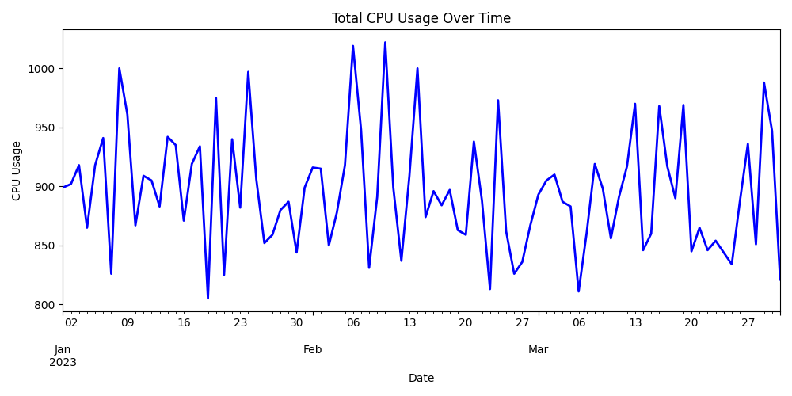
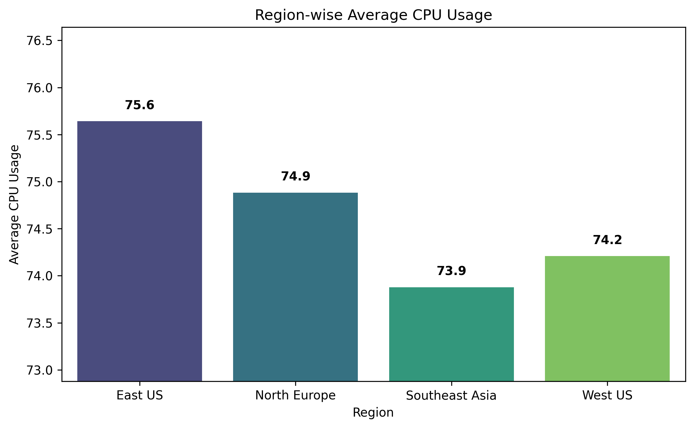
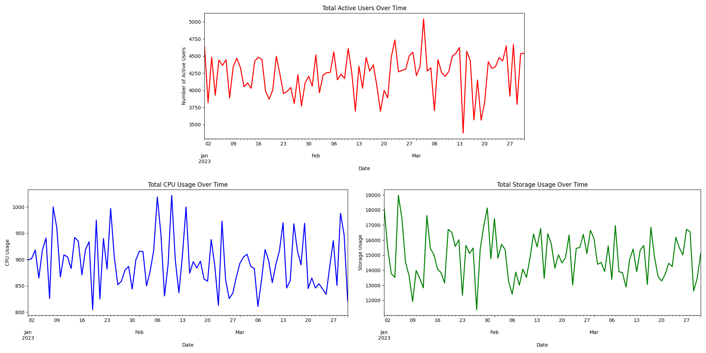
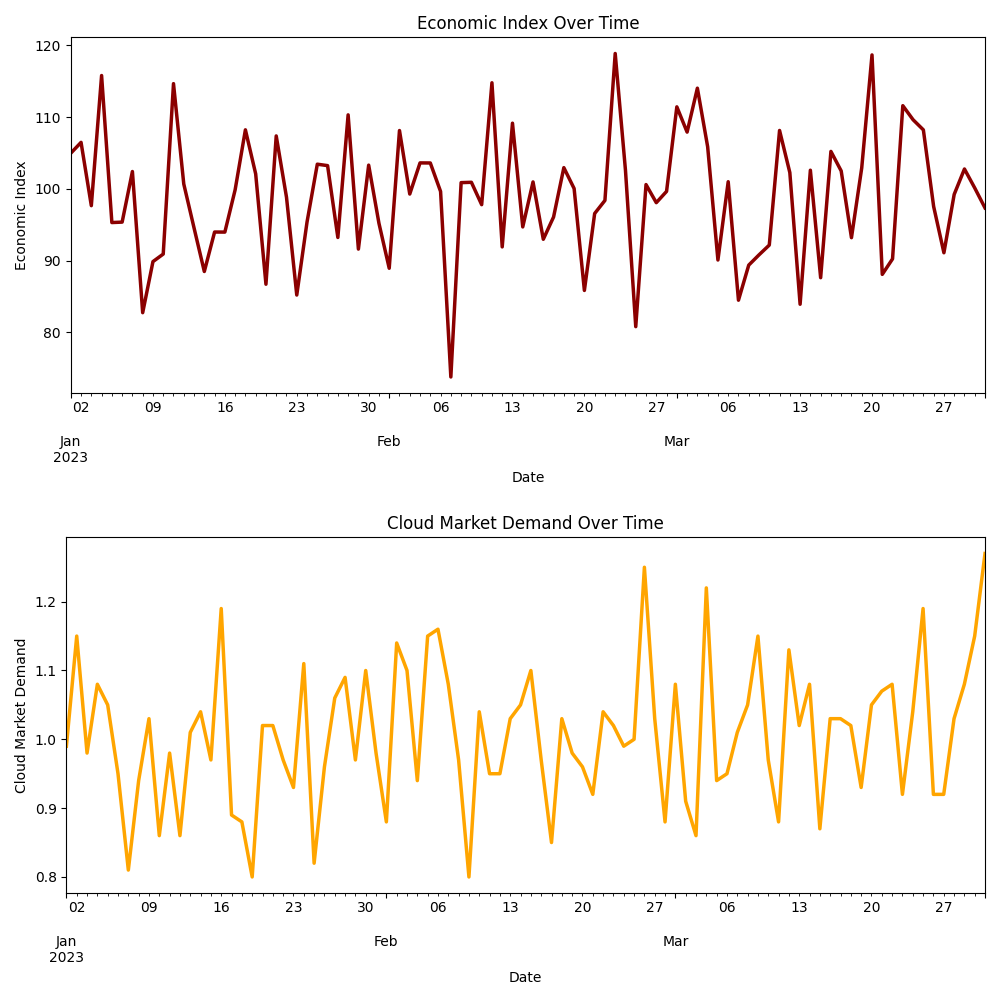
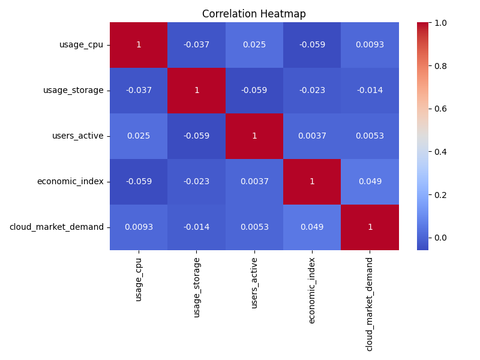

# 📝 EDA Report – Milestone 1

## 📅 Project: Azure Demand Forecasting  
**Milestone:** Data Collection & Preparation  
**Team:** Backend - B  
**Date:** 20-08-25

---

## 1. 📂 Datasets Used

- **`azure_usage.csv`**: Simulated Azure usage data representing daily compute and storage usage across multiple regions and resource types.  
- **`external_factors.csv`**: Daily external economic indicators, cloud market demand metrics, and holiday markers.

---

## 2. 📊 Key Observations

### Azure Usage:
- **Number of records:** 1080  
- **Regions covered:** East US, West US, North Europe, Southeast Asia  
- **Resource types:** VM, Storage, Container  
- **Average CPU usage:** ~74.65 (range: 50 to 99)  
- **Average Storage usage:** ~1242.48 (range: 500 to 1995)  
- **Active users range:** 200 to 499  

### External Data:
- **Economic Index range:** 73.8 (min) to 118.86 (max)  
- **Cloud Market Demand mean:** Approx. 1.02, with standard deviation around 0.12  
- **Holiday:** Binary indicator with weekends and some holidays marked as 1  

---

## 3. 🧼 Data Quality Checks

| Column           | Missing Values | Action Taken                   |
|------------------|----------------|-------------------------------|
| usage_cpu        | 0              | N/A                           |
| usage_storage    | 0              | N/A (No missing values found) |
| users_active     | 0              | N/A                           |
| economic_index   | 0              | N/A                           |
| cloud_market_demand | 0            | N/A                           |
| holiday          | 0              | N/A                           |

---

### Total CPU Usage Trend Over Time  
The CPU usage exhibits a consistent trend with some daily fluctuations visible across the quarter. Peaks align with mid-month periods possibly driven by usage demands.

### Region-wise Average CPU Usage  
The East US region shows the highest average CPU usage, followed by North Europe, West US, and Southeast Asia, indicating variation in infrastructure utilization.

---

## 7. 📈 Combined Usage Trends

### Usage Trends Overview  

### Economic Index and Cloud Market Demand  

---

### Correlation Heatmap  
Clear positive correlations are observed among `usage_cpu`, `usage_storage`, and `users_active`. Economic indicators and cloud market demand show moderate correlation with compute resource usage, guiding further modeling.

---

## 5. 🧩 Merging External Data

Internal Azure usage and external factors data were successfully merged on the `date` column after confirming both datasets had consistent datetime formats. This integration enables enriched analysis incorporating economic and market influences on resource usage.

---

## 6. ✅ Final Output

- The cleaned and fully merged dataset is saved at:  
  `data/processed/cleaned_merged.csv`  
- Dataset is now ready for feature engineering and subsequent model training.

---

## 📌 Notes / Challenges

- Ensuring exact datetime conversion for merging required careful preprocessing.  
- No significant missing data found, simplifying cleaning efforts.  
- External factors provide useful market and holiday context correlated to resource demand, beneficial for forecasting.

---

This comprehensive EDA sets a strong foundation for model development in the next milestones.
